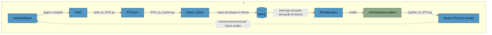

# CTIGraphAnalysis
## Perché questo progetto
**Comprendere** a pieno i dettagli e le sottigliezze della descrizione di un **attacco** o di una **vulnerabilità** è una sfida oggettiva per chi muove i **primi passi nel mondo cyber**. Con l'intento di superare tale difficoltà ho pensato di dar vita a un **metodo strutturato** che potesse facilitare la comprensione e consentisse di **costruire conoscenza** in modo progressivo.

Così ho iniziato a leggere i report e gli articoli di settore cercando di scomporre ogni notizia nei suoi **elementi essenziali**, con l'idea di **rappresentarli visivamente**, per rendere evidenti le relazioni tra loro. Dopo alcune ricerche e valutazioni sullo strumento più adatto per poter rappresentare tali informazioni, e mi permettesse di analizzarle, ho individuato **Neo4j**, un graph database.

Con l'intento di dare coerenza alle informazioni inserite, ho cercato uno **standard** per la creazione di nodi e relazioni. Così ho scoperto **STIX**, lo standard adottato nella cyber threat intelligence per rappresentare informazioni su minacce e incidenti. Adottarlo mi ha permesso di sperimentare un nuovo metodo di lavoro e farlo imparando a conoscere, al contempo, uno strumento chiave per la condivisione di Threat Intelligence.

Il progetto, perciò, si propone un **duplice obiettivo**: fornire un metodo per **studiare** i singoli **eventi di sicurezza**, e al tempo stesso **individuare pattern** ricorrenti tra eventi diversi. Duplice obiettivo che intende spingersi verso una prospettiva macro delle minacce informatiche, servendosi della matrice **MITRE ATT&CK** per la mappatura delle Tattiche, Tecniche e Procedure utilizzate dagli attaccanti. 

## Stack
* Python
* STIX
* Neo4j
* Cypher

## Workflow

## Struttura del repository
```
  ├── README.md  
  ├── requirements.txt  
  ├── yaml_to_STIX.py  
  ├── STIX_to_Cypher.py  
  ├── Cypher_to_STIX.py  
  ├── yaml/
  │   └── 1_nomeArticolo.yaml, 2_nomeArticolo.yaml, ...
  ├── stix/
  │   ├── schemas/
  │   │   └── (schemi delle extension STIX personalizzate)
  │   └── 1_nomeArticolo.json, 1_nomeArticolo_fromQuery.json, ...
  ├── cypher/
  │   └── 1_nomeArticolo.cypher, ...
  └── graphs/
      └── 1_nomeArticolo.svg, ...
```

## Stato del progetto
Iniziato a luglio 2026 - in corso
