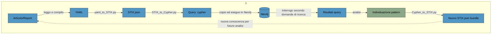

# CTIGraphAnalysis
## Perché questo progetto
**Comprendere** a pieno i dettagli e le sottigliezze della descrizione di un **attacco** o di una **vulnerabilità** è una sfida oggettiva per chi muove i **primi passi nel mondo cyber**. Con l'intento di superare tale difficoltà ho pensato di dar vita a un **metodo strutturato** che potesse facilitare la comprensione e consentisse di **costruire conoscenza** in modo progressivo.

Così ho iniziato a leggere i report e gli articoli di settore cercando di scomporre ogni notizia nei suoi **elementi essenziali**, con l'idea di **rappresentarli visivamente**, per rendere evidenti le relazioni tra loro. Dopo alcune ricerche e valutazioni sullo strumento più adatto per poter rappresentare tali informazioni, e mi permettesse di analizzarle, ho individuato **Neo4j**, un graph database.

Con l'intento di dare coerenza alle informazioni inserite, ho cercato uno **standard** per la creazione di nodi e relazioni. Così ho scoperto **STIX**, lo standard adottato nella cyber threat intelligence per rappresentare informazioni su minacce e incidenti. Adottarlo mi ha permesso di sperimentare un nuovo metodo di lavoro e farlo imparando a conoscere, al contempo, uno strumento chiave per la condivisione di Threat Intelligence.

Il progetto, perciò, si propone un **duplice obiettivo**: fornire un metodo per **studiare** i singoli **eventi di sicurezza**, e al tempo stesso **individuare pattern** ricorrenti tra eventi diversi. Duplice obiettivo che intende spingersi verso una prospettiva macro delle minacce informatiche, servendosi della matrice **MITRE ATT&CK** per la mappatura delle Tattiche, Tecniche e Procedure utilizzate dagli attaccanti. 

## Stack
* Python
* STIX
* Neo4j
* Cypher

## Workflow

```mermaid
flowchart TB
  subgraph 1
    A[Articolo/Report]:::artefatto -->|leggo e compilo| B[YAML]:::artefatto
    B -->|yaml_to_STIX.py| C[STIX.json]:::artefatto
    C -->|STIX_to_Cypher.py| D[Query .cypher]:::artefatto
    D -->|copio ed eseguo in Neo4j| E
    E[(Neo4j)]:::artefatto -->|interrogo secondo domande di ricerca| F[Risultati query]:::artefatto
    F -->|analisi| G[Individuazione pattern]:::manuale
    G -->|Cypher_to_STIX.py| H[Nuovo STIX.json bundle]:::artefatto
    H -.->|nuova conoscenza per future analisi| A
  end
    classDef manuale fill:#8ba888,stroke:#333,color:#000
    classDef artefatto fill:#5197c6,stroke:#333,color:#000
```
## Struttura del repository
```text
  ├── README.md 
  ├── requirements.txt 
  ├── source/ 
  │   ├── yaml_to_STIX.py  
  │   ├── STIX_to_Cypher.py  
  │   └── Cypher_to_STIX.py 
  ├── Yaml/
  │   └── ...
  ├── STIX/
  │   ├── schemas/
  │   │   └── (schemi delle extension STIX personalizzate)
  │   └── ...
  ├── Cypher/
  │   └── ...
  ├── Graphs/
  │   └── ...
  └── analysis/ 
      └── ...  
```

## Stato del progetto
Iniziato a luglio 2026 - in corso  
Attualmente sono predominanti le fasi di creazione STIX e popolamento del graphDB

## Licenza
Questo repository contiene diverse categorie di materiale, per questo utilizza licenze separate, con distribuzione **Source Available / Non-Commercial**:  
| Directories | License |
|---|---|
| source/ | PolyForm NonCommercial 1.0.0 |  
| Yaml/, STIX/, Cypher/, Graphs/, analysis/ | CC BY-NC-SA 4.0 |

Vedere la directory LICENSES/ per il testo completo delle licenze

[![CC BY-NC-SA 4.0][cc-by-nc-sa-shield]][cc-by-nc-sa]
[![PolyForm-Noncommercial-1.0.0][polyform-nc-shield]][polyform-nc]

[polyform-nc]: https://polyformproject.org/licenses/noncommercial/1.0.0
[cc-by-nc-sa]: http://creativecommons.org/licenses/by-nc-sa/4.0/
[cc-by-nc-sa-shield]: https://img.shields.io/badge/LicenseContents-CC%20BY--NC--SA%204.0-lightgrey.svg
[polyform-nc-shield]: https://img.shields.io/badge/LicenseCode-PolyForm%20NC%201.0-lightgrey.svg
